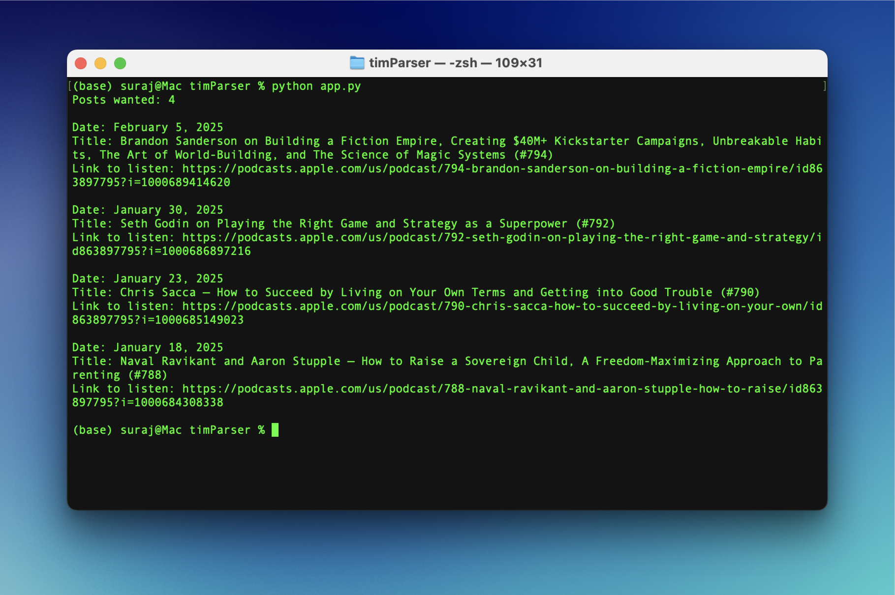
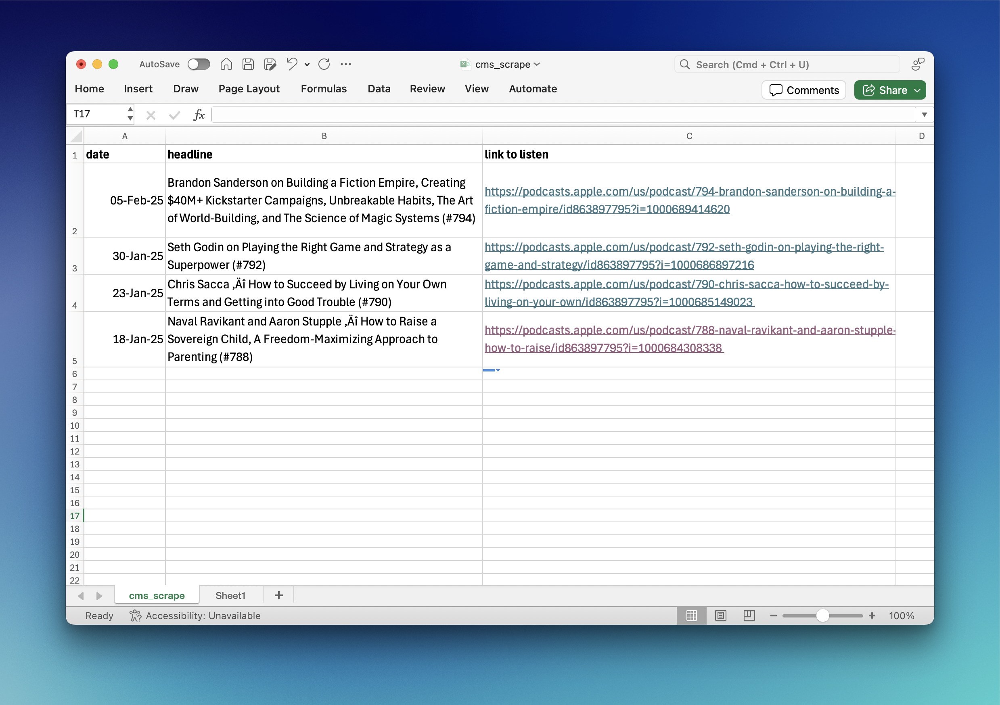

# timParser
 A terminal program to parse details for recent episodes of The Tim Ferriss Show from tim.blog

The program first asks the user for the number of posts/podcasts to load, then goes to tim.blog, and fetches all required number of posts. If the required number if not fulfilled in the first page, the program will go to the next page and continue to parse until condition is met.

